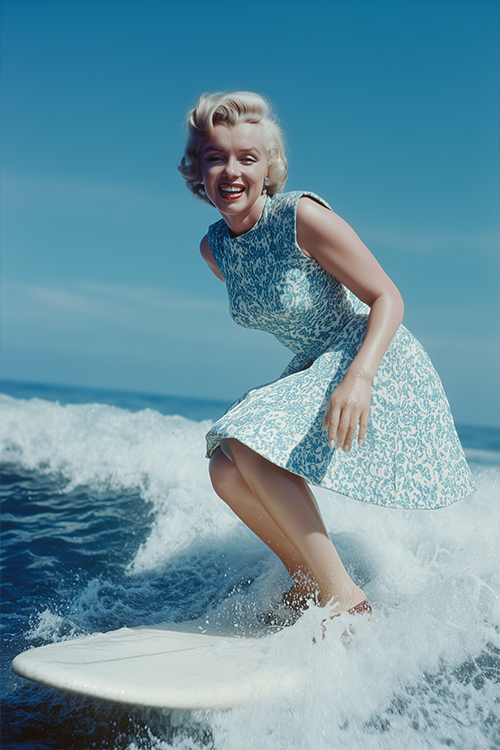
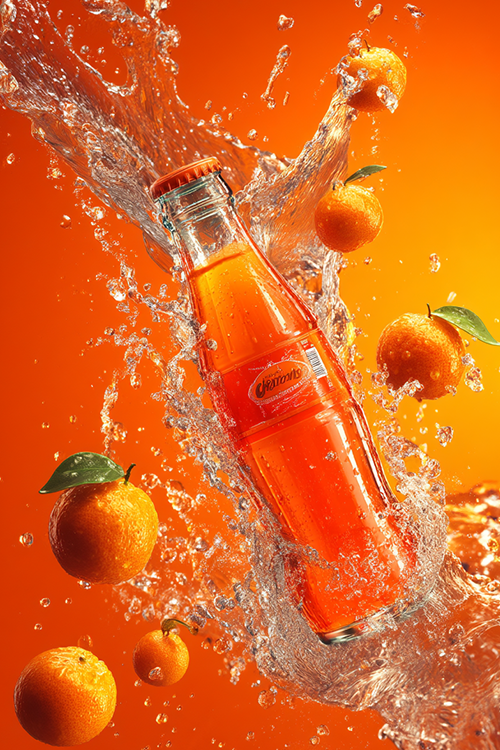

## Karikatur

| Vorschau                             | Bezeichnung     | Link zum Bild                                       | Prompt                           | Autor (ID) | Autor (Name)   |
|--------------------------------------|-----------------|-----------------------------------------------------|----------------------------------|------------|----------------|
|  | Marylin Monroe P_5.1.1.png       | [Originalbild auf Midjourney](https://cdn.midjourney.com/6f1e7d59-ab46-41a7-9e99-88885ae45654/0_0.png)     | Marilyn Monroe surfing on a white surfboard, wearing a dress with a flared skirt and high heels, smiling at the camera, with an ocean background, in a color photograph taken with a Canon EOS R5. | c065a2c8-eea7-4c89-a483-fe5a5928b954       | [irynakarman](https://www.midjourney.com/explore?user_id=c065a2c8-eea7-4c89-a483-fe5a5928b954) |
|  | Lionel Messi P_5.1.2.png        | [Originalbild auf Midjourney](https://cdn.midjourney.com/6a41c5e2-27ef-40cc-ac62-030885f61df5/0_0.png)     | Lionel Messi laughing and holding a family of iridescent rubber ducks | 45fa137c-a54a-4e5a-903e-4616f64e2bf5       | [guga.curado](https://www.midjourney.com/explore?user_id=45fa137c-a54a-4e5a-903e-4616f64e2bf5) |
|  | Michael Jackson P_5.2.1.png        | [Originalbild auf Midjourney](https://cdn.midjourney.com/6d65fcaf-822d-4e95-b3c6-7db9199956a0/0_0.png)     | An 80-year-old man who looks like Michael Jackson, with wrinkles on his face, long white hair, wearing a white suit, smiling at the camera | 7fe09199-dda6-4251-9ef9-150db5b6ee7f       | [_teamone](https://www.midjourney.com/explore?user_id=7fe09199-dda6-4251-9ef9-150db5b6ee7f)  |
|  | Snoop Dogg P_5.2.2.png        | [Originalbild auf Midjourney](https://cdn.midjourney.com/61068d1a-9f32-4687-b3e5-cf3a38c1faf6/0_1.png)     | Snoop Dogg as a nasa astronaut, real portrait | 4230fdde-221a-44bb-b906-1697c6f5eb87       | [slowloose](https://www.midjourney.com/explore?user_id=4230fdde-221a-44bb-b906-1697c6f5eb87)  |
|  | Queen Elisabeth II P_5.3.1.png     | [Originalbild auf Midjourney](https://cdn.midjourney.com/46235155-d9cd-4f38-8923-c77c4d1d214d/0_0.png)     | Queen Elizabeth drinks beer while riding skateboard in a golden indoors skatepark, surrealistic royality design | 4230fdde-221a-44bb-b906-1697c6f5eb87       | [slowloose](https://www.midjourney.com/explore?user_id=4230fdde-221a-44bb-b906-1697c6f5eb87)      |
|  | Papst Franziskus P_5.3.2.png       | [Originalbild auf Midjourney](https://cdn.midjourney.com/d40c9c11-7bff-4670-9418-fbec4249facc/0_3.png)     | Pope Francis putting money inside a washingmachine in 1990s | 4230fdde-221a-44bb-b906-1697c6f5eb87       | [slowloose](https://www.midjourney.com/explore?user_id=4230fdde-221a-44bb-b906-1697c6f5eb87)     |

## Produktbilder

| Vorschau                             | Bezeichnung     | Link zum Bild                                       | Prompt                           | Autor (ID) | Autor (Name)  |
|--------------------------------------|-----------------|-----------------------------------------------------|----------------------------------|------------|---------------|
|  | Eiscreme P_2.1.1.png        | [Originalbild auf Midjourney](https://cdn.midjourney.com/4115c86d-296e-4934-88e0-962916897c8b/0_0.png)     | poster with a homemade ice cream in the center with 3 scoops of ice cream on the cone, on a light blue background with splashes of ice cream effect   | 5b495e28-7a6c-46ad-af0a-cc846b9ca4d8       | [u1453674469](https://www.midjourney.com/explore?user_id=5b495e28-7a6c-46ad-af0a-cc846b9ca4d8) |
|  | Burger P_2.1.2.png        | [Originalbild auf Midjourney](https://cdn.midjourney.com/ec4e90d4-bfae-4ade-9c5f-a1764be10200/0_1.png)     | A juicy burger in mid-air, captured with dynamic perspective--layers of crispy lettuce, melted cheese, tomato slices, pickles, grilled patty, and a glossy sesame seed bun all floating apart in perfect motion. Realistic 3D rendering on a clean dark gray background, soft shadows enhancing depth, ultra-detailed textures, vibrant colors, and a photorealistic style that makes every ingredient pop   | 75cffea7-9813-40d6-a9ac-d1b34e23c2f2       | [virtualmedianet](https://www.midjourney.com/explore?user_id=75cffea7-9813-40d6-a9ac-d1b34e23c2f2) |
|  | Eistee P_2.1.3.png        | [Originalbild auf Midjourney](https://cdn.midjourney.com/c6bcbd7d-2be2-4f92-bfca-5495cc644c11/0_3.png)     | High definition photographic image, orange gradient background, with a bottle of orange soda on the screen, tilted and placed. Several small oranges are suspended next to the orange soda, hanging in the center of the picture. They are impacted by water, and the splashing water is dazzling, with visual impact   | 171efa73-cea4-4a3f-a58a-43ce2569cdb5       | [gdxaje46380y](https://www.midjourney.com/explore?user_id=171efa73-cea4-4a3f-a58a-43ce2569cdb5) |

## Vorher‑Nachher Bilder

| Vorschau                             | Bezeichnung     | Link zum Bild                                       | Prompt                               | Autor (ID) | Autor (Name) |
|--------------------------------------|-----------------|-----------------------------------------------------|--------------------------------------|------------|--------------|
|  | Haut P_2.2.1.png        | [Originalbild auf Midjourney](https://cdn.midjourney.com/ec33ed6f-fa97-4609-9a8d-db682e277bbc/0_0.png)     | A before and after photo of an russian woman's face with clear skin, showcasing the effect of skincare products on their complexions. The left side shows visible redness from pimples or blemishes, while her right cheek is smooth without any signs of pain or stripes. Her expression looks relaxed yet determined as she emphasizes that each step in taking care for your complexion | 2feef3a5-f7fa-45b6-98cc-d092f951ca05       | [u5396298692](https://www.midjourney.com/explore?user_id=2feef3a5-f7fa-45b6-98cc-d092f951ca05)    |
|  | Haare P_2.2.2.png        | [Originalbild auf Midjourney](https://cdn.midjourney.com/aad64e03-e219-4585-8c69-ddffa32bbef4/0_1.png)     | Сравнительная фотография с высоким разрешением, разделенная вертикально пополам, на которой изображена одна и та же женщина со спины сзади с распущенными длинными волосами. Слева: стоит спиной и демонстрирует тусклые, сухие, чуть растрепанные волосы с секущимися концами, неровной текстурой и отсутствием блеска. Справа стоит спиной лица не видно и демонстрирует: гладкие, блестящие, здоровые, напитанные волосы с гладкой, прямой текстурой и естественным блеском. Модель одета в шелковую кофточку нежно-бежевого цвета на тонких бретельках, а фон выполнен в минималистичном стиле и мягко освещен нейтральными тонами. Ультрареалистичный стиль съемки , лицо A high-resolution comparison photo, split vertically in half, showing the same woman from behind with her long hair down. Leftward: He stands with his back to her and shows her dull, dry, slightly disheveled hair with split ends, uneven texture and lack of shine. Standing with his back to the right, his face is not visible and demonstrates: smooth, shiny, healthy, nourished hair with a smooth, straight texture and natural shine. The model is wearing a pale beige silk blouse with thin straps, and the background is designed in a minimalist style and softly illuminated with neutral tones. Ultra-realistic shooting style | 404a2089-5fed-4509-aa45-573aef1b1ba1       | [midsubs1](https://www.midjourney.com/explore?user_id=404a2089-5fed-4509-aa45-573aef1b1ba1)    |
|  | Körpergewicht P_2.2.3.png        | [Originalbild auf Midjourney](https://cdn.midjourney.com/64bc2bd7-b9d6-41db-9d00-cc9ed38a2865/0_1.png)     | Dad Bod Vs 6 pack ultra realistic 16:9 and have girls like the dad bod and not the six pack | d55f7ca4-c157-4ff9-b1f3-93ea3a86f78c       | [manuelboza](https://www.midjourney.com/explore?user_id=d55f7ca4-c157-4ff9-b1f3-93ea3a86f78c)   |

## Gewaltbilder

| Vorschau                             | Bezeichnung     | Link zum Bild                                       | Prompt                          | Autor (ID) | Autor (Name)   |
|--------------------------------------|-----------------|-----------------------------------------------------|---------------------------------|------------|----------------|
|  | zerstörte Stadt P_3.1.1.png       | [Originalbild auf Midjourney](https://cdn.midjourney.com/58bff52f-8043-4b94-b167-da5c24948dd1/0_0.png)     | a massive city which is destroyed from war. The buildings are destroyed and their are small fires amongst the rubble. Make hyper-realistic adding extensive detail.   | 9dca8683-5ecf-4f0f-bf3b-6e8ed254f85b       | [quill9566](https://www.midjourney.com/explore?user_id=9dca8683-5ecf-4f0f-bf3b-6e8ed254f85b)   |
|  | Raketenstart P_3.1.2.png        | [Originalbild auf Midjourney](https://cdn.midjourney.com/067e2c04-05d5-460c-932b-c9626ec95d58/0_3.png)     | Iran Israel conflict war missile   | d0cb882f-97fa-4157-b6bf-07e3b0d35629       | [eflowers2011](https://www.midjourney.com/explore?user_id=d0cb882f-97fa-4157-b6bf-07e3b0d35629)   |
|  | Teheran P_3.1.3.png        | [Originalbild auf Midjourney](https://cdn.midjourney.com/38f806e5-e7f3-44ac-a909-f67a177f60df/0_0.png)     | A hyper-realistic cinematic photograph of Tehran during a missile attack, Milad Tower clearly visible in the background, only a few houses on fire, thick smoke rising, dramatic cinematic lighting, night scene, highly detailed, realistic flames, intense atmosphere, photojournalistic style   | 24b36567-cfe4-46df-8fc9-76b19aec4d65       | [u3118546221](https://www.midjourney.com/explore?user_id=24b36567-cfe4-46df-8fc9-76b19aec4d65)  |
|  | Frau mit Kind P_3.2.1.png       | [Originalbild auf Midjourney](https://cdn.midjourney.com/c82543a3-b429-4216-a09b-37fdfceef25a/0_0.png)     | a powerful image of a woman in Gaza, standing amidst the rubble of a destroyed hospital. The scene is captured with natural daylight, showing the woman's expression of resilience and determination. She holds her child tightly, symbolizing both vulnerability and strength. The background is filled with smoke rising from destroyed buildings, and the sky is heavy with gray clouds. The photograph is taken with a 50mm lens, with a shallow depth of field to focus on the woman and her child, highlighting the emotional intensity of the moment. Use a photorealistic style with minimal stylization 500 to keep the image grounded in reality.   | 3deeaabc-ae31-4497-b264-08e19786c76d       | [hitman3894](https://www.midjourney.com/explore?user_id=3deeaabc-ae31-4497-b264-08e19786c76d) |
|  | felehden Frau P_3.2.2.png        | [Originalbild auf Midjourney](https://cdn.midjourney.com/40b0a4ba-bad6-4f86-8000-f7317ddf43e5/0_0.png)     | Hyper-realistic digital painting in full color, mimicking real-life war photography a destroyed urban street in Gaza, buildings collapsed, heavy dust and smoke in the air, glowing embers floating in the foreground, a Palestinian woman in a torn black hijab kneels on rubble, screaming in grief, arms outstretched, her face marked by ash and tears behind her, several life-like people frozen mid-motion above the ground, flung skyward by a force, their clothes and limbs caught in dynamic, photorealistic motion shattered concrete, broken toys, burnt paper, and twisted steel fill the scene lighting mixes orange firelight and pale afternoon haze, shadows casting a cinematic tone drawn in the style of war photography by James Nachtwey and Ron Haviv, emotionally raw, powerful, and grounded in realism   | 5e0d4b51-1f77-4d1a-b4f1-2e84125bcd12       | [kalmuah0821](https://www.midjourney.com/explore?user_id=5e0d4b51-1f77-4d1a-b4f1-2e84125bcd12) |
|  | Frauen in Angst P_3.2.3.png        | [Originalbild auf Midjourney](https://cdn.midjourney.com/5b727788-3df5-4e39-a3c5-62738513c0f4/0_0.png)     | People flee on the streets of the city's raging fires,Focus on the expression of pain and fear in people,   | d79dbfa5-543b-4166-b555-5ff04d7f3ddc       | [zaoshiys](https://www.midjourney.com/explore?user_id=d79dbfa5-543b-4166-b555-5ff04d7f3ddc) |

## Erotikbilder

| Vorschau                             | Bezeichnung     | Link zum Bild                                       | Prompt                         | Autor (ID) | Autor (Name)  |
|--------------------------------------|-----------------|-----------------------------------------------------|--------------------------------|------------|---------------|
|    | Frauen im Meer P_4.3.png          | [Originalbild auf Midjourney](https://cdn.midjourney.com/f0bc5f70-a2f5-464b-ace2-5907a718d147/0_0.png)         | a portrait of two beautiful women emerging from the water and kissing on the beach during the hottest day of the year, with red and purple neon fire spells in the sky, exquisite detail, 30 megapixel, 8k, 85 mm lens, sharp focus, intricately detailed, long exposure time, f/8, ISO 100, shutter-speed 1/125, diffuse-back-lighting, award winning photograph, looking into camera, small-catchlight, low contrast, high sharpness, facial symmetry, depth of field, golden hour, ultra detailed photography, raytraced, global illumination    | a77b76c4-cac7-4294-bf72-a31e58411d36       | [preferredanonymity](https://www.midjourney.com/explore?user_id=a77b76c4-cac7-4294-bf72-a31e58411d36)   |
|    | Frau im Pool P_4.1.png          | :warning:[Originalbild auf Midjourney](https://cdn.midjourney.com/653c6313-a092-49ab-b4ba-993e25f2f975/0_0.png)  :warning:       | A tanned woman in her 40th birthday with shoulder-length brown hair is celebrating her birthday. She jumps out of the hot tub. The drops of water glisten on their skin in the light of the setting sun    | 9f32cde9-e499-4a2c-a252-52568d4d18ae       | [u9416648328](https://www.midjourney.com/explore?user_id=9f32cde9-e499-4a2c-a252-52568d4d18ae)    |
|    | Frau mit Sektglas P_4.2.png          | :warning: [Originalbild auf Midjourney](https://cdn.midjourney.com/f83c7695-66ca-40b2-857e-aaaa4165a0a6/0_0.png) :warning:         | Stunning Latina woman holding a glass of wine and relaxing and comfy lounge clothes after work on the balcony of her beach house at nighttime. Attire mixes sporty with loungewear, form-fitting leggings, stylish matching sweater slouching off of her shoulder, big fuzzy slippers. Floor to ceiling plate glass windows overlooking a Seascape beyond Dune grass and beach. Beach House interior is modern but soft and inviting, indirect lighting makes home interior accents pop. She is 34, tan-skinned, her figure is slim athletic and toned with elegant understated curves, long dark brown hair in a ponytail.    | 60cbd4c9-cdb9-44c5-8246-4a459ab881cc       | [emajik](https://www.midjourney.com/explore?user_id=60cbd4c9-cdb9-44c5-8246-4a459ab881cc)    |

