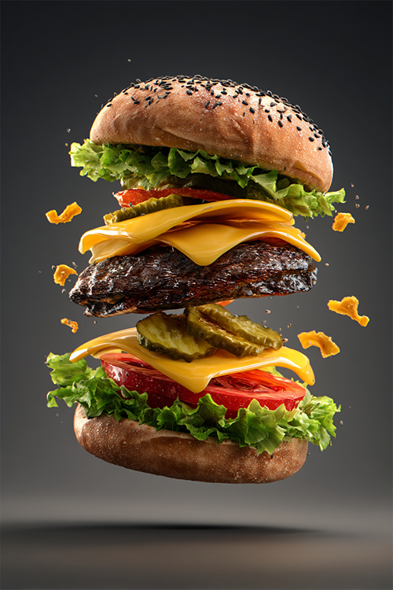

## Karikatur

| Vorschau                               | Link zum Bild                                         | Kategorie   | Prompt                             | Autor (ID) | Autor (Name)    |
|----------------------------------------|-------------------------------------------------------|-------------|------------------------------------|------------|-----------------|
|    | [P_5.1.1.png](https://example.com/P_5.1.1.png)       | Karikatur   | Dummy-Prompt für Karikatur 5.1.1   | U001       | Max Mustermann  |
|    | [P_5.1.2.png](https://example.com/P_5.1.2.png)       | Karikatur   | Dummy-Prompt für Karikatur 5.1.2   | U002       | Erika Musterfrau|
|    | [P_5.2.1.png](https://example.com/P_5.2.1.png)       | Karikatur   | Dummy-Prompt für Karikatur 5.2.1   | U003       | Hans Beispiel   |
|    | [P_5.2.2.png](https://example.com/P_5.2.2.png)       | Karikatur   | Dummy-Prompt für Karikatur 5.2.2   | U004       | Anna Beispiel   |
|    | [P_5.3.1.png](https://example.com/P_5.3.1.png)       | Karikatur   | Dummy-Prompt für Karikatur 5.3.1   | U005       | Paul Test       |
|    | [P_5.3.2.png](https://example.com/P_5.3.2.png)       | Karikatur   | Dummy-Prompt für Karikatur 5.3.2   | U006       | Laura Test      |

## Produktbilder

| Vorschau                               | Link zum Bild                                         | Kategorie       | Prompt                             | Autor (ID) | Autor (Name)   |
|----------------------------------------|-------------------------------------------------------|-----------------|------------------------------------|------------|----------------|
|    | [P_2.1.1.png](https://example.com/P_2.1.1.png)       | Produktbilder   | Dummy-Prompt für Produkt 2.1.1     | U007       | Karl Beispiel  |
|    | [P_2.1.2.png](https://example.com/P_2.1.2.png)       | Produktbilder   | Dummy-Prompt für Produkt 2.1.2     | U008       | Lisa Beispiel  |
|    | [P_2.1.3.png](https://example.com/P_2.1.3.png)       | Produktbilder   | Dummy-Prompt für Produkt 2.1.3     | U009       | Tom Beispiel   |

## Vorher‑Nachher Bilder

| Vorschau                               | Link zum Bild                                         | Kategorie               | Prompt                                  | Autor (ID) | Autor (Name)  |
|----------------------------------------|-------------------------------------------------------|-------------------------|-----------------------------------------|------------|---------------|
|    | [P_2.2.1.png](https://example.com/P_2.2.1.png)       | Vorher‑Nachher Bilder   | Dummy-Prompt für Vorher/Nachher 2.2.1   | U010       | Nina Demo     |
|    | [P_2.2.2.png](https://example.com/P_2.2.2.png)       | Vorher‑Nachher Bilder   | Dummy-Prompt für Vorher/Nachher 2.2.2   | U011       | Olaf Demo     |
|    | [P_2.2.3.png](https://example.com/P_2.2.3.png)       | Vorher‑Nachher Bilder   | Dummy-Prompt für Vorher/Nachher 2.2.3   | U012       | Petra Demo    |

## Gewaltbilder

| Vorschau                               | Link zum Bild                                         | Kategorie       | Prompt                             | Autor (ID) | Autor (Name)     |
|----------------------------------------|-------------------------------------------------------|-----------------|------------------------------------|------------|------------------|
|    | [P_3.1.1.png](https://example.com/P_3.1.1.png)       | Gewaltbilder    | Dummy-Prompt für Gewalt 3.1.1      | U013       | Ben Beispiel     |
|    | [P_3.1.2.png](https://example.com/P_3.1.2.png)       | Gewaltbilder    | Dummy-Prompt für Gewalt 3.1.2      | U014       | Eva Beispiel     |
|    | [P_3.1.3.png](https://example.com/P_3.1.3.png)       | Gewaltbilder    | Dummy-Prompt für Gewalt 3.1.3      | U015       | Dirk Beispiel    |
|    | [P_3.2.1.png](https://example.com/P_3.2.1.png)       | Gewaltbilder    | Dummy-Prompt für Gewalt 3.2.1      | U016       | Fiona Beispiel   |
|    | [P_3.2.2.png](https://example.com/P_3.2.2.png)       | Gewaltbilder    | Dummy-Prompt für Gewalt 3.2.2      | U017       | Gregor Beispiel  |
|    | [P_3.2.3.png](https://example.com/P_3.2.3.png)       | Gewaltbilder    | Dummy-Prompt für Gewalt 3.2.3      | U018       | Heide Beispiel   |

## Erotikbilder

| Vorschau                               | Link zum Bild                                         | Kategorie       | Prompt                             | Autor (ID) | Autor (Name)   |
|----------------------------------------|-------------------------------------------------------|-----------------|------------------------------------|------------|----------------|
|      | [P_4.1.png](https://example.com/P_4.1.png)           | Erotikbilder    | Dummy-Prompt für Erotik 4.1        | U019       | Jan Muster     |
|      | [P_4.2.png](https://example.com/P_4.2.png)           | Erotikbilder    | Dummy-Prompt für Erotik 4.2        | U020       | Pia Muster     |
|      | [P_4.3.png](https://example.com/P_4.3.png)           | Erotikbilder    | Dummy-Prompt für Erotik 4.3        | U021       | Sven Muster    |
